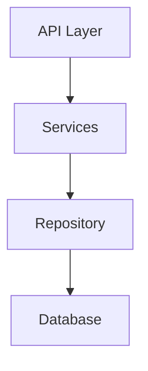

# Analyze Codebase Architecture

Discover and document the existing architecture of your codebase.

## Purpose

This command analyzes your codebase to understand its architecture before making changes. It generates documentation that informs all subsequent development decisions.

**When to Run**:
- Before `/lbi.request` for complex codebases
- Before `/lbi.specify` for any existing codebase
- After significant architectural changes

## Prerequisites

- Project initialized with `lbi init`
- Codebase to analyze (not for greenfield projects)

## Instructions

1. Scan the codebase structure
2. Identify architectural patterns
3. Document technology stack
4. Map component relationships
5. Create architecture documentation

## Analysis Scope

Analyze these architectural aspects:

### 1. Project Structure

```markdown
## Project Structure

| Area | Path | Purpose |
|------|------|---------|
| Source | `src/` | Main application code |
| Tests | `tests/` | Test suites |
| Config | `config/` | Configuration files |
| Docs | `docs/` | Documentation |
```

### 2. Technology Stack

```markdown
## Technology Stack

| Layer | Technology | Version | Purpose |
|-------|------------|---------|---------|
| Language | Python | 3.11+ | Primary language |
| Framework | FastAPI | 0.100+ | Web framework |
| Database | PostgreSQL | 15 | Data persistence |
| ORM | SQLAlchemy | 2.0 | Database abstraction |
```

### 3. Architectural Style

Identify the primary pattern:

- **Monolithic**: Single deployable unit
- **Microservices**: Distributed services
- **Layered**: Presentation → Business → Data
- **Event-Driven**: Message/event based
- **Serverless**: Function-as-a-service

### 4. Component Architecture

```markdown
## Components

### Core Components

| Component | Location | Responsibility |
|-----------|----------|----------------|
| API Layer | `src/api/` | HTTP endpoints |
| Services | `src/services/` | Business logic |
| Models | `src/models/` | Data structures |
| Repository | `src/repositories/` | Data access |

### Component Interactions


```

### 5. Data Architecture

```markdown
## Data Architecture

### Entity Catalog

| Entity | File | Type | Key Fields | Relationships |
|--------|------|------|------------|---------------|
| User | `src/models/user.py` | Model | id, email, name | has_many: Orders |
| Order | `src/models/order.py` | Model | id, user_id, total | belongs_to: User |

### Database Patterns

- Schema design approach
- Migration strategy
- Indexing patterns
- Caching strategy
```

### 6. Integration Points

```markdown
## Integrations

| Service | Purpose | Protocol | Configuration |
|---------|---------|----------|---------------|
| Auth0 | Authentication | OAuth2 | `AUTH0_*` env vars |
| Stripe | Payments | REST API | `STRIPE_*` env vars |
| Redis | Caching | TCP | `REDIS_URL` env var |
```

### 7. Security Architecture

```markdown
## Security

### Authentication

- Provider: [Auth0 / Internal / etc.]
- Methods: [JWT / Sessions / API Keys]

### Authorization

- Model: [RBAC / ABAC / ACL]
- Implementation: [Middleware / Decorators]

### Security Controls

- Input validation
- CORS configuration
- Rate limiting
- Secrets management
```

## Output Files

Create these files in `.lbi/docs/architecture/`:

| File | Description |
|------|-------------|
| `system-analysis.md` | Overall architecture analysis |
| `technology-stack.md` | Technology inventory with versions |
| `component-architecture.md` | Component diagrams and relationships |
| `data-architecture.md` | Data models and entity catalog |
| `integration-landscape.md` | External service integrations |
| `security-architecture.md` | Security patterns and controls |
| `architecture-summary.md` | Compact summary (≤100 lines) |

## Architecture Summary Template

Create a compact summary for quick reference:

```markdown
# Architecture Summary

**Project**: [Name] | **Updated**: [Date]

## Structure (≤10 rows)
| Area | Path | Purpose |
|------|------|---------|

## Stack (≤8 rows)
| Layer | Tech | Version |
|-------|------|---------|

## Critical Paths (≤10 bullets)
- `path` → why it's critical

## Integration Points (≤8 bullets)
- Service → Purpose

## Patterns (≤10 bullets)
- Pattern name: description
```

## Entity Discovery

Scan for entities based on detected language:

| Language | Patterns to Find |
|----------|------------------|
| Python | SQLAlchemy models, Django models, Pydantic |
| JavaScript | Mongoose, Sequelize, TypeORM, Prisma |
| Java | JPA entities, Hibernate |
| Go | GORM structs |
| Ruby | ActiveRecord models |
| PHP | Eloquent, Doctrine |
| C# | Entity Framework |

## Validation Checklist

Before completing:

- [ ] All major components documented
- [ ] Technology versions accurate
- [ ] Entity catalog complete
- [ ] Integration points identified
- [ ] Security controls documented
- [ ] Architecture summary created

## Next Steps

After architecture analysis:
1. Run `/lbi.request` to capture feature requirements
2. Run `/lbi.specify` with architectural context
3. Run `/lbi.validate-architecture` to check compliance