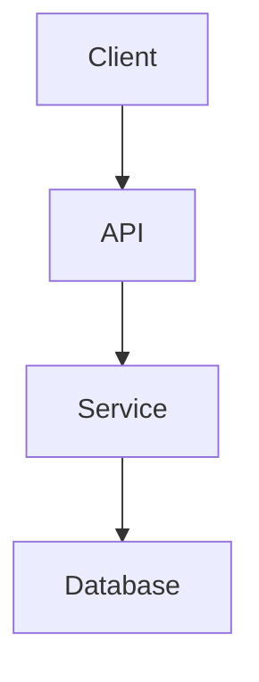

# Documentation

Create and maintain project documentation.

## Purpose

Ensure project documentation is complete, accurate, and up-to-date.

## Prerequisites

- Codebase to document
- Understanding of audience

## Instructions

1. Audit existing documentation
2. Identify gaps
3. Generate/update docs
4. Verify accuracy

## Documentation Types

### README.md

```markdown
# {Project Name}

{One-line description}

## Features

- {Feature 1}
- {Feature 2}

## Installation

```bash
pip install {package}
```

## Quick Start

```python
from {package} import {main_class}

# Usage example
```

## Documentation

- [Getting Started](docs/getting-started.md)
- [API Reference](docs/api.md)
- [Contributing](CONTRIBUTING.md)

## License

{License type}
```

### API Documentation

```markdown
# API Reference

## {Module Name}

### `{function_name}(param1, param2)`

{Brief description}

**Parameters**:
- `param1` (type): Description
- `param2` (type, optional): Description. Defaults to {default}.

**Returns**:
- `type`: Description

**Raises**:
- `ErrorType`: When {condition}

**Example**:

```python
result = function_name("value", param2=True)
```
```

### Architecture Docs

```markdown
# Architecture Overview

## System Diagram



## Components

### {Component Name}

**Purpose**: {What it does}
**Location**: `src/{path}`
**Dependencies**: {List}
```

## Documentation Checklist

```markdown
## Documentation Audit

### Essential Docs

- [ ] README.md complete and current
- [ ] Installation instructions tested
- [ ] Quick start example works
- [ ] API reference generated

### Developer Docs

- [ ] Architecture overview
- [ ] Development setup guide
- [ ] Contributing guidelines
- [ ] Code style guide

### User Docs

- [ ] Getting started tutorial
- [ ] Feature guides
- [ ] FAQ
- [ ] Troubleshooting

### API Docs

- [ ] All public APIs documented
- [ ] Examples for each endpoint
- [ ] Error responses documented
- [ ] Authentication explained
```

## Auto-Documentation

### Docstring Format

```python
def function(param1: str, param2: int = 10) -> bool:
    """
    Brief description of function.

    Longer description if needed, explaining behavior,
    edge cases, and important details.

    Args:
        param1: Description of param1.
        param2: Description of param2. Defaults to 10.

    Returns:
        True if successful, False otherwise.

    Raises:
        ValueError: If param1 is empty.

    Example:
        >>> function("test", param2=5)
        True
    """
```

### Generate API Docs

```bash
# Using pdoc
pdoc --html src/ --output-dir docs/api/

# Using sphinx
sphinx-apidoc -o docs/api src/
```

## Next Steps

After documentation:
1. Run `/lbi.review` for documentation review
2. Keep docs updated with code changes