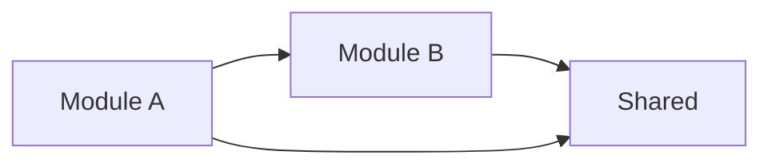

# Validate Architecture Compliance

Check that code changes respect established architectural patterns and boundaries.

## Purpose

Verify that new or modified code adheres to the documented architecture, preventing architectural drift and maintaining system integrity.

## Prerequisites

- Architecture documentation in `.lbi/docs/architecture/`
- Code changes to validate (or full codebase)

## Instructions

1. Load architecture documentation
2. Extract architectural rules and boundaries
3. Validate code against rules
4. Report compliance status

## Validation Categories

### 1. Layer Boundaries

Verify that code respects layer separation:

```markdown
## Layer Boundary Check

| Layer | Can Import From | Cannot Import From |
|-------|-----------------|-------------------|
| API | Services, Models | — |
| Services | Repository, Models | API |
| Repository | Models | API, Services |
| Models | — | API, Services, Repository |

### Violations Found

| File | Imports | Violation |
|------|---------|-----------|
| `src/api/users.py` | `src/repository/db.py` | API → Repository (should use Service) |
```

### 2. Module Boundaries

Check that modules don't cross boundaries:

```markdown
## Module Boundary Check

### Allowed Dependencies



### Detected Cross-Module Imports

| From Module | To Module | Files | Status |
|-------------|-----------|-------|--------|
| users | orders | 2 | ⚠️ Check if intended |
| auth | users | 1 | ✅ Expected |
```

### 3. Pattern Compliance

Verify adherence to documented patterns:

```markdown
## Pattern Compliance

### Repository Pattern

- [ ] All data access through repository classes
- [ ] No direct ORM calls in service layer
- [ ] Repository methods return domain objects

### Dependency Injection

- [ ] Dependencies injected, not instantiated
- [ ] Interfaces used for dependencies
- [ ] No service locator anti-pattern

### Error Handling

- [ ] Exceptions follow hierarchy
- [ ] No swallowed exceptions
- [ ] Proper error propagation
```

### 4. Technology Constraints

Check technology usage matches documentation:

```markdown
## Technology Constraints

| Category | Allowed | Found | Status |
|----------|---------|-------|--------|
| ORM | SQLAlchemy | SQLAlchemy | ✅ |
| HTTP Client | httpx | requests | ❌ Unapproved |
| Testing | pytest | pytest | ✅ |
```

### 5. Security Boundaries

Validate security-related patterns:

```markdown
## Security Boundary Check

### Authentication

- [ ] Auth middleware on all protected routes
- [ ] No hardcoded credentials
- [ ] Secrets loaded from environment

### Data Access

- [ ] Parameterized queries (no SQL injection)
- [ ] Input validation on all endpoints
- [ ] Output encoding for user data
```

## Validation Process

### Step 1: Load Architecture Docs

Read architecture documentation:

```bash
# Expected files
.lbi/docs/architecture/
├── system-analysis.md
├── component-architecture.md
├── data-architecture.md
└── architecture-summary.md
```

### Step 2: Extract Rules

Parse documentation for:

- Layer definitions and dependencies
- Module boundaries
- Pattern requirements
- Technology constraints
- Security rules

### Step 3: Analyze Code

For each rule, scan codebase:

```python
# Example: Check layer violations
for file in source_files:
    imports = extract_imports(file)
    layer = determine_layer(file)
    for imp in imports:
        if violates_layer_rule(layer, imp):
            report_violation(file, imp)
```

### Step 4: Generate Report

```markdown
# Architecture Compliance Report

**Date**: [YYYY-MM-DD]
**Scope**: [Full codebase / PR #X / Files changed]

## Summary

| Category | Checks | Passing | Failing |
|----------|--------|---------|---------|
| Layer Boundaries | X | Y | Z |
| Module Boundaries | X | Y | Z |
| Pattern Compliance | X | Y | Z |
| Technology | X | Y | Z |
| Security | X | Y | Z |
| **Total** | **X** | **Y** | **Z** |

## Critical Violations

### ❌ [Violation Category]

**Location**: `path/to/file.py:42`
**Rule**: [Which rule was violated]
**Issue**: [What's wrong]
**Fix**: [How to resolve]

## Warnings

### ⚠️ [Warning Category]

**Location**: `path/to/file.py:15`
**Concern**: [What might be problematic]
**Recommendation**: [Suggested action]

## Passed Checks

- ✅ Layer boundaries respected
- ✅ No circular dependencies
- ✅ Security patterns followed
```

## Common Architectural Violations

| Violation | Description | Impact | Fix |
|-----------|-------------|--------|-----|
| Layer Skip | API calls Repository directly | Bypasses business logic | Route through Service |
| Circular Import | A imports B, B imports A | Build/runtime issues | Extract shared interface |
| Anemic Domain | Logic in services, not models | DDD violation | Move logic to domain |
| God Class | Single class does too much | Maintainability | Split responsibilities |

## Integration with Workflow

### Pre-Commit Validation

```bash
# Run before committing
lbi validate-architecture --staged
```

### PR Validation

```bash
# Validate changes in PR
lbi validate-architecture --diff main...HEAD
```

### Full Codebase

```bash
# Validate entire codebase
lbi validate-architecture --all
```

## Output

Save report to `.lbi/reports/architecture-compliance-[date].md`

## Exit Status

- **Exit 0**: All checks pass
- **Exit 1**: Violations found
- **Exit 2**: Architecture docs not found

## Next Steps

After validation:
- If passing: Proceed with `/lbi.review` or `/lbi.push`
- If violations: Fix issues or update architecture docs if intentional
- If warnings: Review and address if needed