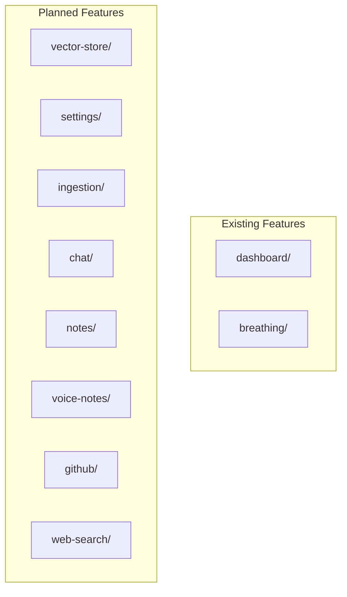
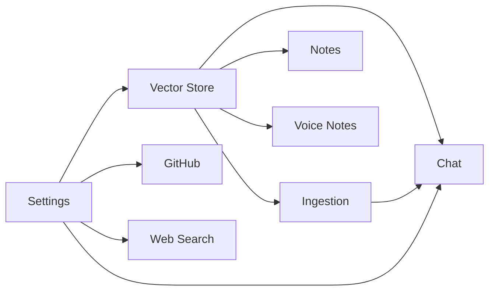

# Component Architecture: Second Brain Desktop Application

## Overview

This document describes the React component architecture, feature module structure, and IPC communication patterns.

## Feature Module Pattern

Every feature follows this standardized structure:

```
src/features/{feature-name}/
├── components/                 # React components
│   ├── {ComponentName}.tsx
│   └── __tests__/
│       └── {ComponentName}.test.tsx
├── hooks/                      # Custom React hooks
│   ├── use{HookName}.ts
│   └── __tests__/
│       └── use{HookName}.test.ts
├── context/                    # React context (if stateful)
│   └── {Feature}Context.tsx
├── services/                   # Business logic (if applicable)
│   ├── {ServiceName}Service.ts
│   └── __tests__/
│       └── {ServiceName}Service.test.ts
├── types/                      # TypeScript definitions
│   └── {feature-name}.types.ts
├── constants/                  # Constants (optional)
│   ├── {feature-name}.constants.ts
│   └── __tests__/
│       └── {feature-name}.constants.test.ts
└── index.ts                    # Barrel export
```

## Feature Modules

### Existing Features



### Feature Dependency Graph



## Component Hierarchy

### Application Root

```tsx
// src/App.tsx
<ElectronProvider>
  <SettingsProvider>
    <VectorStoreProvider>
      <Router>
        <AppLayout>
          <Routes>
            <Route path="/" element={<ChatPage />} />
            <Route path="/notes" element={<NotesPage />} />
            <Route path="/settings" element={<SettingsPage />} />
            <Route path="/dashboard" element={<DashboardPage />} />
          </Routes>
        </AppLayout>
      </Router>
    </VectorStoreProvider>
  </SettingsProvider>
</ElectronProvider>
```

### Context Provider Pattern

```tsx
// Example: src/features/settings/context/SettingsContext.tsx
interface ISettingsContext {
  apiKeys: IApiKeys;
  featureFlags: IFeatureFlags;
  updateApiKey: (key: string, value: string) => Promise<void>;
  toggleFeature: (feature: string, enabled: boolean) => void;
}

const SettingsContext = createContext<ISettingsContext | null>(null);

export function SettingsProvider({ children }: { children: ReactNode }) {
  // State and logic
  return (
    <SettingsContext.Provider value={contextValue}>
      {children}
    </SettingsContext.Provider>
  );
}

export function useSettings(): ISettingsContext {
  const context = useContext(SettingsContext);
  if (!context) {
    throw new Error('useSettings must be used within SettingsProvider');
  }
  return context;
}
```

### Hook Pattern

```tsx
// Example: src/features/vector-store/hooks/useVectorStore.ts
interface UseVectorStoreOptions {
  autoSync?: boolean;
  syncInterval?: number;
}

interface UseVectorStoreReturn {
  entries: IVectorEntry[];
  isLoading: boolean;
  error: string | null;
  addEntry: (entry: IVectorEntry) => Promise<void>;
  search: (query: string, limit?: number) => Promise<ISearchResult[]>;
  deleteEntry: (id: string) => Promise<void>;
}

export function useVectorStore(
  options: UseVectorStoreOptions = {}
): UseVectorStoreReturn {
  // Implementation
}
```

## IPC Communication Pattern

### Main Process Handler Registration

```typescript
// electron/modules/vector-store.ts
import { ipcMain } from 'electron';

export function registerVectorStoreHandlers(): void {
  ipcMain.handle('vector-add', async (_event, entry: IVectorEntry) => {
    // Validate input
    // Process entry
    // Return result
  });

  ipcMain.handle('vector-search', async (_event, query: string, limit: number) => {
    // Search logic
  });

  ipcMain.handle('vector-delete', async (_event, id: string) => {
    // Delete logic
  });
}
```

### Preload API Extension

```typescript
// electron/preload.ts
interface VectorStoreAPI {
  addEntry: (entry: IVectorEntry) => Promise<void>;
  search: (query: string, limit?: number) => Promise<ISearchResult[]>;
  deleteEntry: (id: string) => Promise<void>;
}

const vectorStoreAPI: VectorStoreAPI = {
  addEntry: (entry) => ipcRenderer.invoke('vector-add', entry),
  search: (query, limit = 10) => ipcRenderer.invoke('vector-search', query, limit),
  deleteEntry: (id) => ipcRenderer.invoke('vector-delete', id),
};

contextBridge.exposeInMainWorld('vectorStoreAPI', vectorStoreAPI);
```

### Type Declaration

```typescript
// src/shared/types/vector-store.d.ts
declare global {
  interface Window {
    vectorStoreAPI?: VectorStoreAPI;
  }
}
```

## Component Design Principles

### Single Responsibility

Each component has one purpose:

| Component | Responsibility |
|-----------|----------------|
| `ChatWindow` | Container for chat interface |
| `MessageList` | Display list of messages |
| `MessageInput` | Handle user text input |
| `SourceSelector` | Select data sources for RAG |

### Props Interface Pattern

```typescript
/**
 * Props for the MessageList component
 */
interface IMessageListProps {
  /** Array of chat messages to display */
  messages: IChatMessage[];
  /** Whether messages are currently loading */
  isLoading?: boolean;
  /** Callback when user clicks a source reference */
  onSourceClick?: (sourceId: string) => void;
  /** Optional CSS class for styling */
  className?: string;
}
```

### Composition Over Inheritance

```tsx
// Composable components
<StatCard
  label="Memory Usage"
  value={formatBytes(memory.used)}
  icon={<MemoryIcon />}
  trend={memoryTrend}
/>

// Not inheritance-based class components
```

## Shared Components

Location: `src/shared/components/`

| Component | Purpose |
|-----------|---------|
| `Button` | Reusable button with variants |
| `Input` | Form input with validation |
| `Modal` | Dialog/modal wrapper |
| `Spinner` | Loading indicator |
| `ErrorBoundary` | Error boundary wrapper |

## Barrel Export Pattern

Every feature's `index.ts` exports its public API:

```typescript
// src/features/chat/index.ts

// Components
export { ChatWindow } from './components/ChatWindow';
export { MessageList } from './components/MessageList';
export { MessageInput } from './components/MessageInput';

// Hooks
export { useChat } from './hooks/useChat';
export type { UseChatOptions, UseChatReturn } from './hooks/useChat';

// Context
export { ChatProvider, useChat } from './context/ChatContext';

// Types
export type {
  IChatMessage,
  IChatContext,
  ISourceReference,
} from './types/chat.types';
```

## Testing Strategy

### Component Tests

```tsx
// src/features/chat/components/__tests__/MessageList.test.tsx
import { render, screen } from '@testing-library/react';
import { MessageList } from '../MessageList';

describe('MessageList', () => {
  it('renders messages correctly', () => {
    const messages = [
      { id: '1', role: 'user', content: 'Hello' },
      { id: '2', role: 'assistant', content: 'Hi there!' },
    ];

    render(<MessageList messages={messages} />);

    expect(screen.getByText('Hello')).toBeInTheDocument();
    expect(screen.getByText('Hi there!')).toBeInTheDocument();
  });
});
```

### Hook Tests

```tsx
// src/features/chat/hooks/__tests__/useChat.test.ts
import { renderHook, act } from '@testing-library/react';
import { useChat } from '../useChat';

describe('useChat', () => {
  it('sends messages correctly', async () => {
    const { result } = renderHook(() => useChat());

    await act(async () => {
      await result.current.sendMessage('Hello');
    });

    expect(result.current.messages).toHaveLength(2); // user + assistant
  });
});
```
