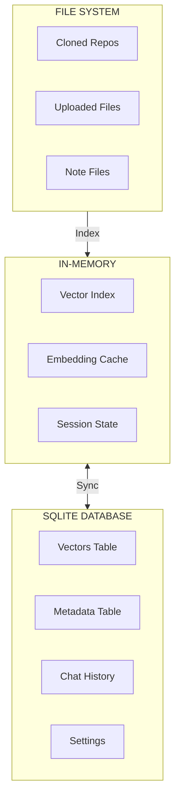
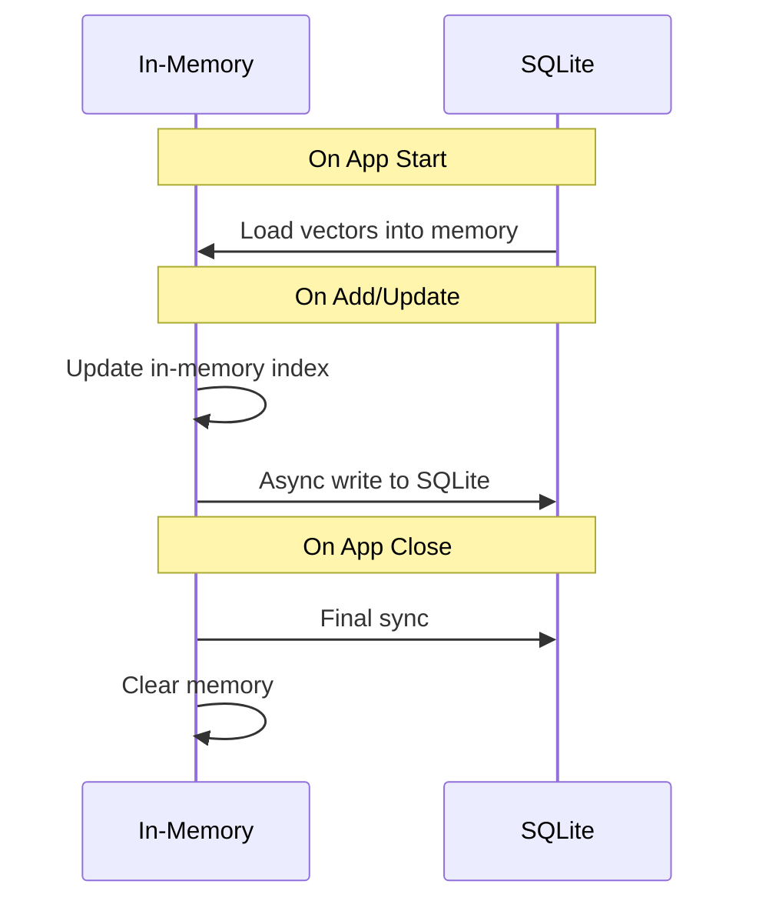

# Data Architecture: Second Brain Desktop Application

## Overview

This document describes the data models, storage strategies, and database schema for the Second Brain application.

## Storage Strategy

### Local-First Approach

All data is stored locally on the user's machine:



### Data Location

```
{APP_DATA}/
├── vectors.db            # SQLite database with vector data
├── settings.encrypted    # Encrypted API keys (safeStorage)
├── repos/                # Cloned GitHub repositories
│   └── {owner}-{repo}/
├── uploads/              # Uploaded documents (optional cache)
└── notes/                # Markdown note files
```

## Entity Catalog

### Vector Entry

Primary entity for all ingested content:

```typescript
/**
 * A single entry in the vector database
 */
interface IVectorEntry {
  /** Unique identifier (UUID) */
  id: string;
  /** Source type of the content */
  sourceType: VectorSourceType;
  /** Original content text */
  content: string;
  /** Vector embedding (float array) */
  embedding: number[];
  /** Associated metadata */
  metadata: IVectorMetadata;
  /** Creation timestamp */
  createdAt: Date;
  /** Last update timestamp */
  updatedAt: Date;
}

type VectorSourceType = 
  | 'document'      // PDF, DOCX, HTML, MD
  | 'web'           // Web URL
  | 'github-code'   // Code file from repo
  | 'github-issue'  // GitHub issue
  | 'github-pr'     // GitHub PR
  | 'github-diff'   // Code diff
  | 'note'          // User markdown note
  | 'voice'         // Transcribed voice note
  | 'image';        // Image description/OCR
```

### Vector Metadata

Rich metadata for filtering and context:

```typescript
/**
 * Metadata associated with a vector entry
 */
interface IVectorMetadata {
  /** Original filename or title */
  title: string;
  /** Source URL or file path */
  sourcePath: string;
  /** MIME type of original content */
  mimeType?: string;
  /** LLM-generated classification/tags */
  classification?: string[];
  /** User-defined tags */
  tags?: string[];
  /** Language of content */
  language?: string;
  /** For GitHub: repository URL */
  repoUrl?: string;
  /** For GitHub: commit hash */
  commitHash?: string;
  /** For GitHub: file path in repo */
  filePath?: string;
  /** For chunked content: chunk index */
  chunkIndex?: number;
  /** For chunked content: total chunks */
  totalChunks?: number;
  /** Word count */
  wordCount?: number;
  /** Character count */
  charCount?: number;
}
```

### Chat Message

```typescript
/**
 * A single chat message
 */
interface IChatMessage {
  /** Unique identifier */
  id: string;
  /** Conversation ID for grouping */
  conversationId: string;
  /** Message role */
  role: 'user' | 'assistant' | 'system';
  /** Message content */
  content: string;
  /** Source references used in RAG */
  sources?: ISourceReference[];
  /** Timestamp */
  timestamp: Date;
}

/**
 * Reference to a source used in RAG response
 */
interface ISourceReference {
  /** Vector entry ID */
  entryId: string;
  /** Relevance score (0-1) */
  score: number;
  /** Snippet of relevant content */
  snippet: string;
  /** Source metadata */
  metadata: IVectorMetadata;
}
```

### Settings

```typescript
/**
 * Application settings
 */
interface ISettings {
  /** API key configuration */
  apiKeys: IApiKeys;
  /** Feature toggles */
  features: IFeatureFlags;
  /** User preferences */
  preferences: IUserPreferences;
}

interface IApiKeys {
  groq?: string;
  openai?: string;
  anthropic?: string;
  tavily?: string;
  github?: string;
}

interface IFeatureFlags {
  multimodalEnabled: boolean;
  dashboardEnabled: boolean;
  webSearchEnabled: boolean;
  githubEnabled: boolean;
  voiceNotesEnabled: boolean;
}

interface IUserPreferences {
  theme: 'light' | 'dark' | 'system';
  embeddingModel: 'groq' | 'openai' | 'local';
  maxHistoryLength: number;
  autoSyncInterval: number;
}
```

## SQLite Schema

### vectors Table

```sql
CREATE TABLE vectors (
    id TEXT PRIMARY KEY,
    source_type TEXT NOT NULL,
    content TEXT NOT NULL,
    embedding BLOB NOT NULL,  -- Serialized float array
    metadata JSON NOT NULL,
    created_at DATETIME DEFAULT CURRENT_TIMESTAMP,
    updated_at DATETIME DEFAULT CURRENT_TIMESTAMP
);

CREATE INDEX idx_vectors_source_type ON vectors(source_type);
CREATE INDEX idx_vectors_created_at ON vectors(created_at);
```

### chat_messages Table

```sql
CREATE TABLE chat_messages (
    id TEXT PRIMARY KEY,
    conversation_id TEXT NOT NULL,
    role TEXT NOT NULL CHECK (role IN ('user', 'assistant', 'system')),
    content TEXT NOT NULL,
    sources JSON,
    timestamp DATETIME DEFAULT CURRENT_TIMESTAMP
);

CREATE INDEX idx_chat_conversation ON chat_messages(conversation_id);
CREATE INDEX idx_chat_timestamp ON chat_messages(timestamp);
```

### conversations Table

```sql
CREATE TABLE conversations (
    id TEXT PRIMARY KEY,
    title TEXT,
    created_at DATETIME DEFAULT CURRENT_TIMESTAMP,
    updated_at DATETIME DEFAULT CURRENT_TIMESTAMP
);
```

### settings Table

```sql
CREATE TABLE settings (
    key TEXT PRIMARY KEY,
    value JSON NOT NULL,
    updated_at DATETIME DEFAULT CURRENT_TIMESTAMP
);
```

## Vector Search

### Similarity Search

```typescript
interface ISearchOptions {
  /** Query text to embed and search */
  query: string;
  /** Maximum results to return */
  limit?: number;
  /** Minimum similarity threshold (0-1) */
  threshold?: number;
  /** Filter by source types */
  sourceTypes?: VectorSourceType[];
  /** Filter by tags */
  tags?: string[];
}

interface ISearchResult {
  /** Matching vector entry */
  entry: IVectorEntry;
  /** Cosine similarity score (0-1) */
  score: number;
  /** Distance metric */
  distance: number;
}
```

### Search Algorithm


## Chunking Strategy

For large documents, content is chunked before embedding:

| Content Type | Chunk Size | Overlap |
|--------------|------------|---------|
| PDF/DOCX | 1000 chars | 200 chars |
| Markdown | By heading | 100 chars |
| Code | By function/class | 50 lines |
| HTML | By paragraph | 100 chars |

```typescript
interface IChunkConfig {
  maxChunkSize: number;
  overlapSize: number;
  separators: string[];
}

const DEFAULT_CHUNK_CONFIG: IChunkConfig = {
  maxChunkSize: 1000,
  overlapSize: 200,
  separators: ['\n\n', '\n', '. ', ' '],
};
```

## Data Sync Strategy

### In-Memory to SQLite



### Sync Triggers

| Event | Action |
|-------|--------|
| App Start | Load SQLite → Memory |
| Add Entry | Memory → Async SQLite |
| App Close | Final sync Memory → SQLite |
| Manual Sync | Memory ↔ SQLite reconciliation |
| Periodic (5 min) | Dirty entries → SQLite |

## Data Migration

### Version Management

```sql
CREATE TABLE schema_version (
    version INTEGER PRIMARY KEY,
    applied_at DATETIME DEFAULT CURRENT_TIMESTAMP
);
```

### Migration Pattern

```typescript
interface IMigration {
  version: number;
  up: (db: Database) => void;
  down: (db: Database) => void;
}

const migrations: IMigration[] = [
  {
    version: 1,
    up: (db) => {
      db.exec(`CREATE TABLE vectors (...)`);
    },
    down: (db) => {
      db.exec(`DROP TABLE vectors`);
    },
  },
  // Additional migrations...
];
```

## Backup Strategy

| Data | Backup Method | Frequency |
|------|---------------|-----------|
| SQLite DB | File copy | On app close |
| Settings | JSON export | On change |
| Notes | Git-style versioning | On save |

## Performance Considerations

| Operation | Target | Strategy |
|-----------|--------|----------|
| Vector Search | < 100ms | In-memory index |
| Add Entry | < 500ms | Async SQLite write |
| Load on Start | < 3s | Lazy loading |
| Embedding Gen | < 2s | API call batching |
