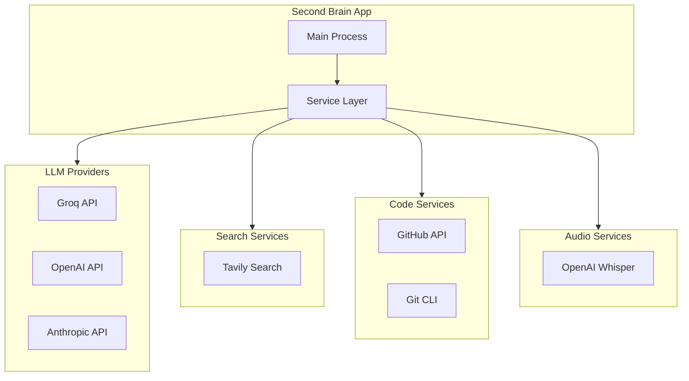
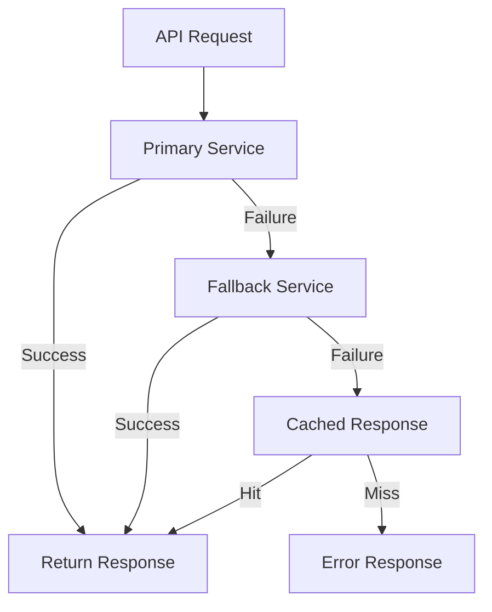

# Integration Landscape: Second Brain Desktop Application

## Overview

This document catalogs all external service integrations, their purposes, and implementation patterns.

## Integration Map



## Groq LLM Integration

### Purpose
Primary LLM provider for chat completions and RAG responses.

### Configuration

| Setting | Value | Description |
|---------|-------|-------------|
| API Key | `GROQ_API_KEY` | Stored in safeStorage |
| Base URL | `https://api.groq.com/openai/v1` | API endpoint |
| Default Model | `llama-3.3-70b-versatile` | Primary model |
| Fallback Model | `llama-3.1-8b-instant` | Fast fallback |

### Implementation

```typescript
// electron/services/GroqService.ts
import Groq from 'groq-sdk';

export class GroqService {
  private client: Groq;

  constructor(apiKey: string) {
    this.client = new Groq({ apiKey });
  }

  async chat(
    messages: IChatMessage[],
    options?: IChatOptions
  ): Promise<IChatResponse> {
    const response = await this.client.chat.completions.create({
      model: options?.model ?? 'llama-3.3-70b-versatile',
      messages: messages.map(m => ({
        role: m.role,
        content: m.content,
      })),
      temperature: options?.temperature ?? 0.7,
      max_tokens: options?.maxTokens ?? 2048,
    });

    return {
      content: response.choices[0]?.message?.content ?? '',
      usage: response.usage,
    };
  }
}
```

### Error Handling

| Error | Action |
|-------|--------|
| 401 Unauthorized | Prompt user to update API key |
| 429 Rate Limited | Exponential backoff, max 3 retries |
| 500+ Server Error | Retry once, then show error |
| Network Error | Check connectivity, retry |

---

## OpenAI Integration

### Purpose
- Embedding generation (text-embedding-3-small)
- Whisper transcription (audio-to-text)
- Fallback LLM (optional)

### Configuration

| Setting | Value | Description |
|---------|-------|-------------|
| API Key | `OPENAI_API_KEY` | Stored in safeStorage |
| Base URL | `https://api.openai.com/v1` | API endpoint |
| Embedding Model | `text-embedding-3-small` | 1536 dimensions |
| Whisper Model | `whisper-1` | Transcription |

### Implementation

```typescript
// electron/services/EmbeddingService.ts
import OpenAI from 'openai';

export class EmbeddingService {
  private client: OpenAI;

  constructor(apiKey: string) {
    this.client = new OpenAI({ apiKey });
  }

  async generateEmbedding(text: string): Promise<number[]> {
    const response = await this.client.embeddings.create({
      model: 'text-embedding-3-small',
      input: text,
    });

    return response.data[0].embedding;
  }

  async generateBatchEmbeddings(texts: string[]): Promise<number[][]> {
    const response = await this.client.embeddings.create({
      model: 'text-embedding-3-small',
      input: texts,
    });

    return response.data.map(d => d.embedding);
  }
}
```

---

## Tavily Search Integration

### Purpose
Web search for real-time information retrieval.

### Configuration

| Setting | Value | Description |
|---------|-------|-------------|
| API Key | `TAVILY_API_KEY` | Stored in safeStorage |
| Base URL | `https://api.tavily.com` | API endpoint |
| Search Depth | `basic` or `advanced` | Result depth |

### Implementation

```typescript
// electron/services/TavilyService.ts
interface ITavilySearchResult {
  title: string;
  url: string;
  content: string;
  score: number;
}

export class TavilyService {
  private apiKey: string;

  constructor(apiKey: string) {
    this.apiKey = apiKey;
  }

  async search(
    query: string,
    options?: ISearchOptions
  ): Promise<ITavilySearchResult[]> {
    const response = await fetch('https://api.tavily.com/search', {
      method: 'POST',
      headers: {
        'Content-Type': 'application/json',
      },
      body: JSON.stringify({
        api_key: this.apiKey,
        query,
        search_depth: options?.depth ?? 'basic',
        max_results: options?.maxResults ?? 5,
        include_answer: true,
        include_raw_content: false,
      }),
    });

    const data = await response.json();
    return data.results;
  }
}
```

---

## GitHub Integration

### Purpose
- Clone repositories for code vectorization
- Fetch issues, PRs, and diffs
- Code search within repos

### Configuration

| Setting | Value | Description |
|---------|-------|-------------|
| API Key | `GITHUB_TOKEN` | Personal access token |
| Base URL | `https://api.github.com` | API endpoint |
| Repos Dir | `{APP_DATA}/repos/` | Clone location |

### Implementation

```typescript
// electron/services/GitHubService.ts
import { Octokit } from '@octokit/rest';
import simpleGit, { SimpleGit } from 'simple-git';

export class GitHubService {
  private octokit: Octokit;
  private git: SimpleGit;

  constructor(token: string, reposDir: string) {
    this.octokit = new Octokit({ auth: token });
    this.git = simpleGit();
  }

  async cloneRepo(owner: string, repo: string): Promise<string> {
    const repoPath = path.join(this.reposDir, `${owner}-${repo}`);
    
    if (!existsSync(repoPath)) {
      await this.git.clone(
        `https://github.com/${owner}/${repo}.git`,
        repoPath
      );
    }

    return repoPath;
  }

  async getIssues(owner: string, repo: string): Promise<IGitHubIssue[]> {
    const { data } = await this.octokit.issues.listForRepo({
      owner,
      repo,
      state: 'all',
      per_page: 100,
    });

    return data.map(issue => ({
      number: issue.number,
      title: issue.title,
      body: issue.body ?? '',
      state: issue.state,
      labels: issue.labels.map(l => 
        typeof l === 'string' ? l : l.name ?? ''
      ),
      createdAt: issue.created_at,
    }));
  }

  async getPullRequests(owner: string, repo: string): Promise<IGitHubPR[]> {
    const { data } = await this.octokit.pulls.list({
      owner,
      repo,
      state: 'all',
      per_page: 100,
    });

    return data.map(pr => ({
      number: pr.number,
      title: pr.title,
      body: pr.body ?? '',
      state: pr.state,
      diff_url: pr.diff_url,
      createdAt: pr.created_at,
    }));
  }

  async getPRDiff(owner: string, repo: string, prNumber: number): Promise<string> {
    const { data } = await this.octokit.pulls.get({
      owner,
      repo,
      pull_number: prNumber,
      mediaType: { format: 'diff' },
    });

    return data as unknown as string;
  }
}
```

### Repository Structure Vectorization

| Content Type | Extraction Method | Metadata |
|--------------|-------------------|----------|
| Code Files | File read + chunking | filePath, language, repoUrl |
| README | Markdown parse | title, repoUrl |
| Issues | GitHub API | number, labels, state |
| PRs | GitHub API | number, state, diff_url |
| Diffs | GitHub API (diff format) | prNumber, files changed |

---

## Whisper Transcription Integration

### Purpose
Convert voice recordings to text for note-taking.

### Configuration

| Setting | Value | Description |
|---------|-------|-------------|
| API Key | `OPENAI_API_KEY` | Shared with embeddings |
| Model | `whisper-1` | Transcription model |
| Language | `auto` | Auto-detect language |

### Implementation

```typescript
// electron/services/TranscriptionService.ts
import OpenAI from 'openai';
import { createReadStream } from 'fs';

export class TranscriptionService {
  private client: OpenAI;

  constructor(apiKey: string) {
    this.client = new OpenAI({ apiKey });
  }

  async transcribe(audioPath: string): Promise<ITranscription> {
    const response = await this.client.audio.transcriptions.create({
      file: createReadStream(audioPath),
      model: 'whisper-1',
      response_format: 'verbose_json',
    });

    return {
      text: response.text,
      language: response.language,
      duration: response.duration,
      segments: response.segments,
    };
  }

  async cleanTranscription(text: string): Promise<string> {
    // Use LLM to clean up filler words, fix grammar
    const prompt = `Clean up this transcription. Remove filler words (um, uh, like), fix grammar, and format as clear text:\n\n${text}`;
    
    // Call Groq/OpenAI for cleaning
    return cleanedText;
  }
}
```

---

## Integration Health Monitoring

### Health Check Pattern

```typescript
interface IIntegrationHealth {
  service: string;
  status: 'healthy' | 'degraded' | 'down';
  latency?: number;
  lastChecked: Date;
  error?: string;
}

async function checkIntegrationHealth(): Promise<IIntegrationHealth[]> {
  const checks = [
    checkGroq(),
    checkOpenAI(),
    checkTavily(),
    checkGitHub(),
  ];

  return Promise.all(checks);
}
```

### Circuit Breaker Pattern

| State | Behavior |
|-------|----------|
| Closed | Normal operation |
| Open | Fail fast, skip API calls |
| Half-Open | Try one request to test recovery |

---

## Rate Limiting

| Service | Limit | Strategy |
|---------|-------|----------|
| Groq | 30 RPM (free) | Queue with delay |
| OpenAI | 60 RPM (tier 1) | Queue with delay |
| Tavily | 100/day (free) | Daily counter |
| GitHub | 5000/hour | Exponential backoff |

---

## Fallback Strategy


