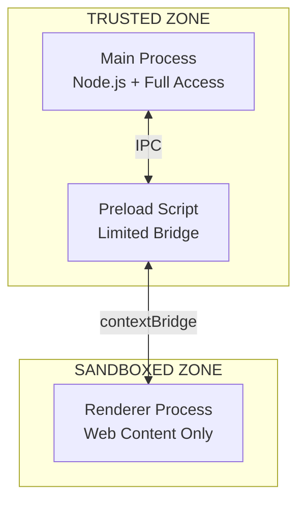
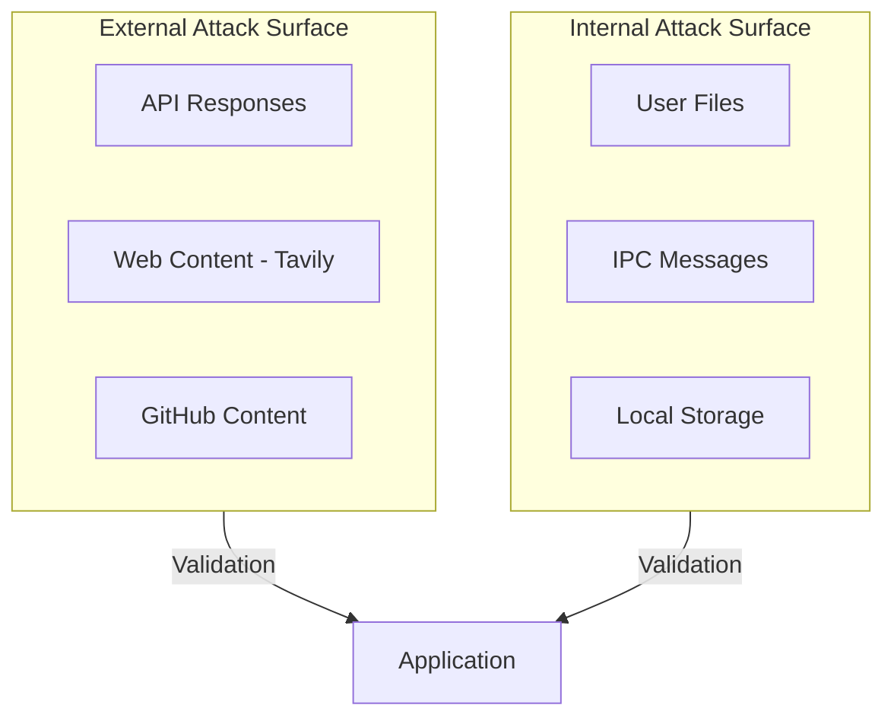

# Security Architecture: Second Brain Desktop Application

## Overview

This document describes the security model, threat mitigations, and best practices for the Second Brain Desktop Application.

## Security Principles

1. **Least Privilege**: Components have minimal required permissions
2. **Defense in Depth**: Multiple security layers
3. **Secure by Default**: Safe configurations out of the box
4. **Local-First**: Sensitive data stays on user's machine

## Electron Security Model

### Process Isolation



### Security Configuration

```typescript
// electron/main.ts
const mainWindow = new BrowserWindow({
  webPreferences: {
    // CRITICAL SECURITY SETTINGS
    nodeIntegration: false,         // No Node.js in renderer
    contextIsolation: true,         // Separate contexts
    sandbox: false,                 // Required for IPC (carefully considered)
    webSecurity: true,              // Enable same-origin policy
    allowRunningInsecureContent: false,  // No HTTP in HTTPS
    
    // Preload for safe API exposure
    preload: join(__dirname, 'preload.js'),
  },
});
```

### Context Isolation

```typescript
// electron/preload.ts
// ONLY expose specific, validated APIs
contextBridge.exposeInMainWorld('electronAPI', {
  // Each method is explicitly defined
  getMemoryStats: () => ipcRenderer.invoke('get-memory-stats'),
  // NO arbitrary IPC access
  // NO file system access
  // NO shell execution
});
```

## Content Security Policy (CSP)

### Development CSP

```typescript
const DEV_CSP = [
  "default-src 'self'",
  "script-src 'self' 'unsafe-inline' 'unsafe-eval'",  // Vite HMR
  "style-src 'self' 'unsafe-inline'",
  "connect-src 'self' ws://localhost:* http://localhost:*",
  "img-src 'self' data:",
  "font-src 'self'",
].join('; ');
```

### Production CSP

```typescript
const PROD_CSP = [
  "default-src 'self'",
  "script-src 'self'",
  "style-src 'self' 'unsafe-inline'",  // Required for Tailwind
  "img-src 'self' data:",
  "font-src 'self'",
  "connect-src 'self'",  // No external connections from renderer
].join('; ');
```

### CSP Enforcement

```typescript
// electron/main.ts
function setupSecurityHeaders(): void {
  session.defaultSession.webRequest.onHeadersReceived((details, callback) => {
    callback({
      responseHeaders: {
        ...details.responseHeaders,
        'Content-Security-Policy': [
          isDev ? DEV_CSP : PROD_CSP
        ],
      },
    });
  });
}
```

## API Key Security

### Secure Storage

```typescript
// electron/services/SecureStorageService.ts
import { safeStorage } from 'electron';

export class SecureStorageService {
  private static readonly PREFIX = 'secondbrain_';

  /**
   * Store API key securely using OS keychain
   */
  static async storeApiKey(key: string, value: string): Promise<void> {
    if (!safeStorage.isEncryptionAvailable()) {
      throw new Error('Secure storage not available');
    }

    const encrypted = safeStorage.encryptString(value);
    await this.writeToFile(`${this.PREFIX}${key}`, encrypted);
  }

  /**
   * Retrieve API key from secure storage
   */
  static async getApiKey(key: string): Promise<string | null> {
    const encrypted = await this.readFromFile(`${this.PREFIX}${key}`);
    if (!encrypted) return null;

    return safeStorage.decryptString(encrypted);
  }
}
```

### Key Handling Rules

| Rule | Implementation |
|------|----------------|
| Never log API keys | Redact in all log outputs |
| Never send to renderer | Keys stay in main process |
| Never hardcode | Environment or secure storage only |
| Validate on use | Check key format before API calls |

## Input Validation

### IPC Handler Validation

```typescript
// electron/modules/vector-store.ts
import { z } from 'zod';

const VectorEntrySchema = z.object({
  id: z.string().uuid(),
  sourceType: z.enum(['document', 'web', 'github-code', 'note']),
  content: z.string().min(1).max(100000),
  metadata: z.object({
    title: z.string().max(500),
    sourcePath: z.string().max(1000),
  }),
});

ipcMain.handle('vector-add', async (_event, entry: unknown) => {
  // ALWAYS validate input from renderer
  const validated = VectorEntrySchema.parse(entry);
  
  // Proceed with validated data
  return vectorStore.add(validated);
});
```

### Path Traversal Prevention

```typescript
// electron/utils/pathValidation.ts
import { resolve, normalize } from 'path';

export function validatePath(basePath: string, userPath: string): string {
  const resolvedPath = resolve(basePath, userPath);
  const normalizedBase = normalize(basePath);

  // Ensure path doesn't escape base directory
  if (!resolvedPath.startsWith(normalizedBase)) {
    throw new Error('Path traversal attempt detected');
  }

  return resolvedPath;
}
```

## Navigation Security

### Restrict Navigation

```typescript
// electron/main.ts
app.on('web-contents-created', (_event, contents) => {
  // Prevent navigation to external URLs
  contents.on('will-navigate', (event, navigationUrl) => {
    const parsedUrl = new URL(navigationUrl);

    // Allow only expected origins
    const allowedOrigins = isDev 
      ? [`http://localhost:${WEB_PORT}`]
      : ['file://'];

    if (!allowedOrigins.some(o => parsedUrl.origin === o || parsedUrl.protocol === 'file:')) {
      event.preventDefault();
      console.warn('Blocked navigation to:', navigationUrl);
    }
  });

  // Prevent opening new windows
  contents.setWindowOpenHandler(() => {
    return { action: 'deny' };
  });
});
```

## External URL Handling

### Safe External Link Opening

```typescript
// electron/preload.ts
import { shell } from 'electron';

// Expose safe external link opener
contextBridge.exposeInMainWorld('electronAPI', {
  openExternal: (url: string) => {
    // Validate URL before opening
    try {
      const parsed = new URL(url);
      if (parsed.protocol === 'https:' || parsed.protocol === 'http:') {
        shell.openExternal(url);
      }
    } catch {
      console.error('Invalid URL:', url);
    }
  },
});
```

## File System Security

### Restricted File Access

```typescript
// electron/services/FileService.ts
export class FileService {
  private readonly allowedDirs: string[];

  constructor() {
    this.allowedDirs = [
      app.getPath('userData'),  // App data directory
      app.getPath('temp'),       // Temp directory
    ];
  }

  async readFile(filePath: string): Promise<Buffer> {
    // Validate path is within allowed directories
    const resolved = resolve(filePath);
    const isAllowed = this.allowedDirs.some(dir => 
      resolved.startsWith(resolve(dir))
    );

    if (!isAllowed) {
      throw new Error('File access denied: outside allowed directories');
    }

    return fs.promises.readFile(resolved);
  }
}
```

## Network Security

### API Request Validation

```typescript
// electron/services/ApiClient.ts
export class ApiClient {
  private readonly allowedHosts = [
    'api.groq.com',
    'api.openai.com',
    'api.anthropic.com',
    'api.tavily.com',
    'api.github.com',
  ];

  async fetch(url: string, options: RequestInit): Promise<Response> {
    const parsed = new URL(url);

    // Validate host is in allowlist
    if (!this.allowedHosts.includes(parsed.host)) {
      throw new Error(`Request to ${parsed.host} not allowed`);
    }

    // Ensure HTTPS
    if (parsed.protocol !== 'https:') {
      throw new Error('Only HTTPS requests allowed');
    }

    return fetch(url, options);
  }
}
```

## Threat Model

### Threat Matrix

| Threat | Impact | Mitigation |
|--------|--------|------------|
| XSS in renderer | High | CSP, context isolation |
| API key theft | High | safeStorage, no renderer access |
| Path traversal | High | Path validation |
| Code injection | Critical | No eval, CSP |
| Man-in-the-middle | High | HTTPS only, certificate validation |
| Local file theft | Medium | Restricted file access |

### Attack Surface



## Security Checklist

### Development

- [ ] Run `npm audit` regularly
- [ ] Keep Electron updated
- [ ] Review IPC handlers for validation
- [ ] Test CSP in production mode
- [ ] Check for hardcoded secrets

### Code Review

- [ ] No `nodeIntegration: true`
- [ ] No `contextIsolation: false`
- [ ] No `webSecurity: false`
- [ ] No `eval()` or `new Function()`
- [ ] All IPC inputs validated
- [ ] API keys not logged

### Release

- [ ] Code signing enabled
- [ ] Auto-update over HTTPS
- [ ] Production CSP active
- [ ] Debug tools disabled
- [ ] Source maps excluded

## Incident Response

1. **Detection**: Monitor for unusual API usage, file access patterns
2. **Containment**: Disable affected feature via settings toggle
3. **Eradication**: Release patch with fix
4. **Recovery**: Auto-update to patched version
5. **Lessons**: Document and update threat model
