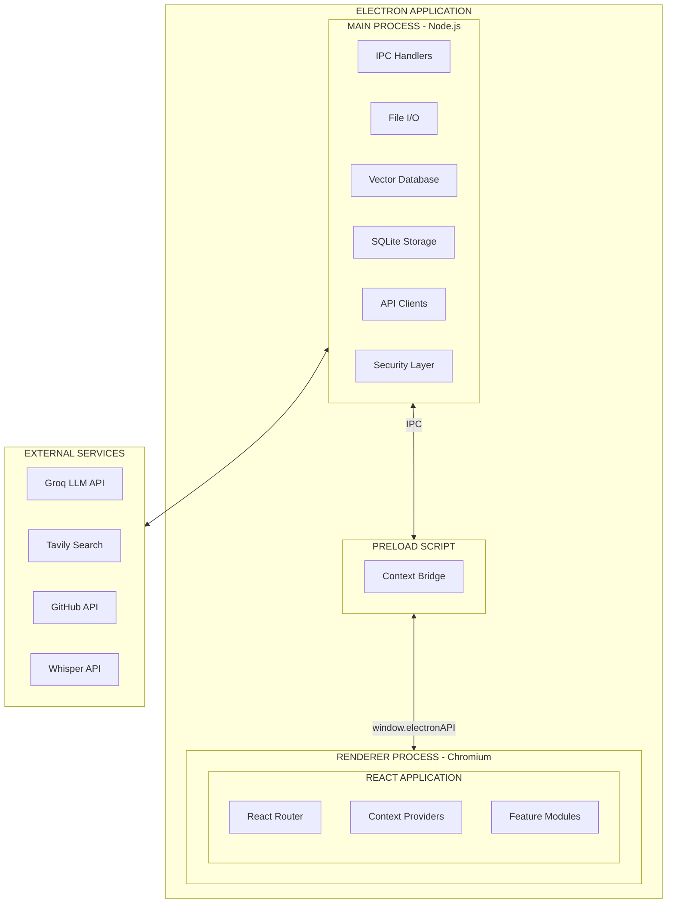
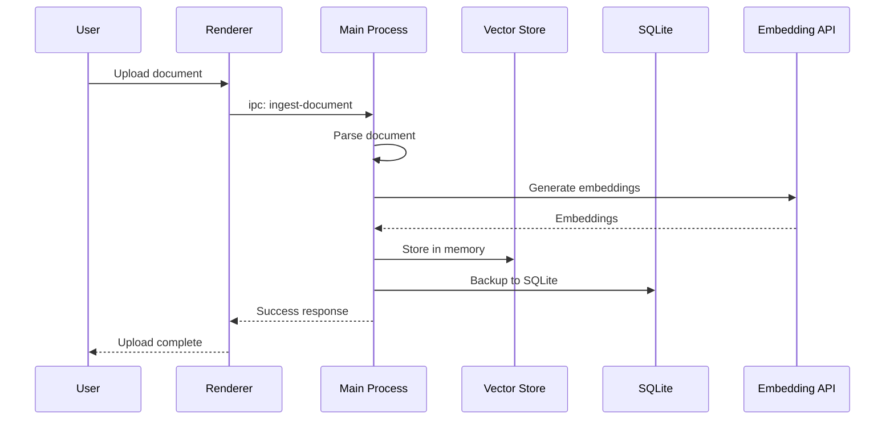
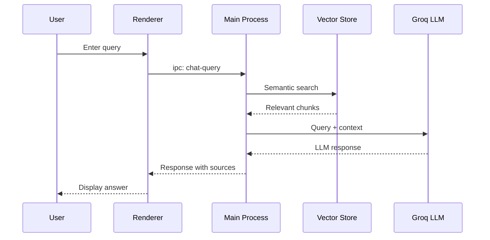
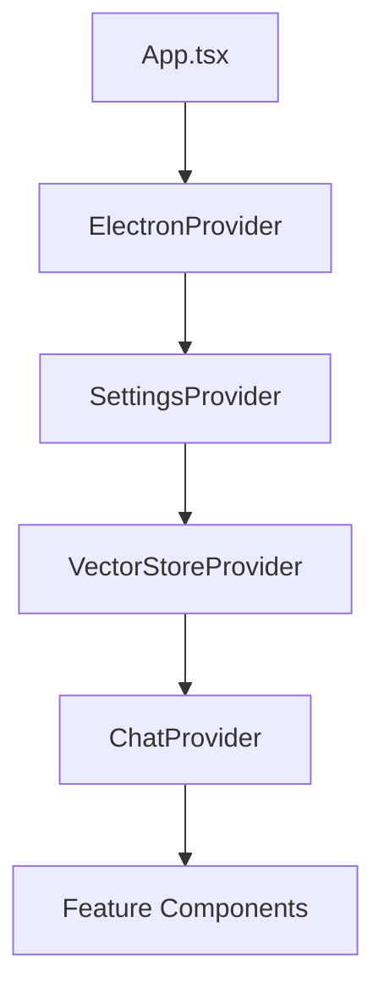

# System Analysis: Second Brain Desktop Application

## Overview

The Second Brain Desktop Application is an Electron-based knowledge management system that enables users to ingest, organize, vectorize, and query diverse data sources through an AI-powered chat interface with Retrieval-Augmented Generation (RAG).

## System Architecture



## Process Architecture

### Main Process (Node.js)

The main process runs in a Node.js environment with full system access:

| Responsibility | Description |
|----------------|-------------|
| Window Management | Create and manage BrowserWindow instances |
| IPC Handlers | Process requests from renderer via ipcMain |
| File System Access | Read/write files, manage repos directory |
| Database Management | SQLite operations, vector store management |
| API Integration | External service clients (Groq, Tavily, GitHub) |
| Security | CSP headers, safe storage, input validation |

### Preload Script

The preload script runs in an isolated context with access to both Node.js and DOM APIs:

| Responsibility | Description |
|----------------|-------------|
| Context Bridge | Expose safe APIs to renderer via contextBridge |
| API Definition | Define the ElectronAPI interface |
| Security Boundary | Prevent direct Node.js access from renderer |

### Renderer Process (Chromium)

The renderer process runs in a sandboxed Chromium environment:

| Responsibility | Description |
|----------------|-------------|
| UI Rendering | React components and styling |
| State Management | React Context for feature state |
| User Interaction | Event handling, form processing |
| Data Display | Charts, tables, chat interface |

## Data Flow Patterns

### Ingestion Flow



### Query Flow (RAG)



## Module Communication

### IPC Channel Naming Convention

```
{feature}-{action}[-{detail}]

Examples:
- vector-add
- vector-search
- settings-get
- settings-secure-store
- chat-query
- ingestion-parse
- github-clone
```

### Context Provider Hierarchy



## Deployment Architecture

### Build Outputs

| Platform | Output | Location |
|----------|--------|----------|
| Windows | `.exe` installer | `dist/` |
| macOS | `.dmg` / `.app` | `dist/` |
| Linux | `.AppImage` / `.deb` | `dist/` |

### File System Layout (User Data)

```
~/AppData/Local/SecondBrain/  (Windows)
~/Library/Application Support/SecondBrain/  (macOS)
~/.config/SecondBrain/  (Linux)
├── config.json           # User preferences
├── vectors.db            # SQLite + vector data
├── chat-history.db       # Chat conversation history
└── repos/                # Cloned GitHub repositories
    └── {owner}-{repo}/
```

## Scalability Considerations

| Aspect | Approach | Limit |
|--------|----------|-------|
| Vector Entries | In-memory with SQLite backup | 10,000 entries |
| Chat History | SQLite with pagination | Unlimited (disk) |
| Cloned Repos | User's disk space | ~10 repos recommended |
| Concurrent Queries | Single-threaded main process | 1 at a time |

## Error Handling Strategy

1. **IPC Errors**: Return `null` or error object; renderer displays user-friendly message
2. **API Errors**: Retry with exponential backoff; cache last successful response
3. **File Errors**: Log to console; notify user of specific failure
4. **Vector DB Errors**: Fallback to SQLite read; rebuild index if corrupted
