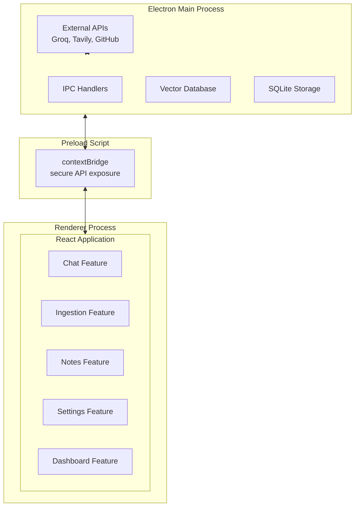

# Second Brain Desktop Application

A secure, local-first knowledge management desktop application that enables users to ingest, organize, vectorize, and interact with diverse data sources through an AI-powered chat interface with Retrieval-Augmented Generation (RAG).

Built with React 19, Vite 7, TypeScript, and Electron 40. Features modular architecture, SOLID principles, and comprehensive testing.


## Features

### Core Capabilities
- **AI-Powered Chat**: Query your knowledge base with Groq LLM and RAG for context-aware responses
- **Document Ingestion**: Upload and vectorize PDFs, DOCX, Markdown, and HTML files
- **Web Search**: Ingest web URLs and search via Tavily integration
- **GitHub Integration**: Clone repositories and vectorize code, issues, PRs, and diffs
- **Voice Notes**: Record, transcribe (Whisper), and vectorize spoken notes
- **Markdown Editor**: Write and auto-vectorize notes with a clean editor

### Technical Features
- **Local-First Storage**: In-memory vector database with SQLite backup
- **Secure API Keys**: Electron safeStorage for encrypted credential storage
- **Real-time Dashboard**: System monitoring (memory, network, processes) - toggleable
- **Modern Stack**: React 19, Vite 7, Electron 40, TypeScript 5.7
- **SOLID Architecture**: Feature-based modular design with dependency injection
- **Comprehensive Testing**: Vitest with 80% coverage target
- **CI/CD Ready**: GitHub Actions workflow included
- **Electron Security**: Context isolation, CSP, secure IPC

## Quick Start

```bash
# Install dependencies (requires Node.js 20+)
npm install

# Start web development server
npm run dev

# Start desktop development
npm run dev:desktop

# Run tests
npm run test

# Build for production
npm run build:desktop
```

## Scripts

| Script | Description |
|--------|-------------|
| `npm run dev` | Start Vite dev server (web preview) |
| `npm run dev:desktop` | Start Electron with hot-reload |
| `npm run build` | Build web application |
| `npm run build:desktop` | Build Electron for all platforms |
| `npm run build:desktop:win` | Build for Windows |
| `npm run build:desktop:mac` | Build for macOS |
| `npm run build:desktop:linux` | Build for Linux |
| `npm run test` | Run tests in watch mode |
| `npm run test:run` | Run tests once |
| `npm run test:coverage` | Run tests with coverage |
| `npm run lint` | Run ESLint |

## Documentation

| Document | Description |
|----------|-------------|
| [Architecture](docs/ARCHITECTURE.md) | System design and SOLID principles |
| [Getting Started](docs/GETTING-STARTED.md) | Development setup guide |
| [Feature Development](docs/FEATURE-DEVELOPMENT.md) | How to create new features |
| [API Reference](docs/API.md) | IPC handlers, Electron API, type definitions |
| [Extension Guide](docs/EXTENSION-GUIDE.md) | How to add new data sources and widgets |
| [Contributing](docs/CONTRIBUTING.md) | Development workflow and guidelines |
| [PRD](docs/DESKTOP-2ndBRAIN-PRD.md) | Product Requirements Document |

### Architecture Documentation

| Document | Description |
|----------|-------------|
| [System Analysis](.lbi/docs/architecture/system-analysis.md) | Overall system architecture |
| [Technology Stack](.lbi/docs/architecture/technology-stack.md) | Technologies and versions |
| [Component Architecture](.lbi/docs/architecture/component-architecture.md) | React component patterns |
| [Data Architecture](.lbi/docs/architecture/data-architecture.md) | Data models and storage |
| [Integration Landscape](.lbi/docs/architecture/integration-landscape.md) | External API integrations |
| [Security Architecture](.lbi/docs/architecture/security-architecture.md) | Security model |

## Project Structure

```
├── electron/                 # Electron main process
│   ├── main.ts              # App lifecycle, security, IPC handlers
│   └── preload.ts           # Secure API bridge
├── src/
│   ├── features/            # Feature modules
│   │   ├── dashboard/       # System stats dashboard
│   │   ├── chat/            # AI chat interface (planned)
│   │   ├── ingestion/       # Document ingestion (planned)
│   │   ├── vector-store/    # Vector database (planned)
│   │   ├── settings/        # App settings (planned)
│   │   ├── notes/           # Markdown editor (planned)
│   │   └── github/          # GitHub integration (planned)
│   ├── shared/              # Shared utilities
│   │   ├── context/         # App-wide contexts
│   │   ├── lib/             # Utility functions
│   │   └── types/           # Shared type definitions
│   ├── test/                # Test utilities and mocks
│   └── main.tsx             # Entry point
├── docs/                    # Documentation
├── .lbi/                    # LBI workflow specs and docs
│   ├── memory/              # Constitution
│   ├── docs/                # Architecture documentation
│   └── specs/               # Feature specifications
├── .cursor/                 # Cursor configuration
│   ├── commands/            # LBI commands
│   └── rules/               # Project conventions
└── .github/workflows/       # CI/CD configuration
```

## Tech Stack

| Technology | Version | Purpose |
|------------|---------|---------|
| React | 19.x | UI framework |
| Vite | 7.x | Build tool |
| Electron | 40+ | Desktop framework |
| TypeScript | 5.7 | Type safety |
| Tailwind CSS | 4.x | Styling |
| Recharts | 2.x | Data visualization |
| Vitest | 4.x | Testing |
| LangChain.js | - | RAG orchestration |
| Groq SDK | - | LLM integration |
| SQLite | - | Local storage |

## Architecture Overview

Second Brain follows SOLID principles and a feature-based modular architecture:



## Security

Electron security features enabled:

- `nodeIntegration: false` - No Node.js in renderer
- `contextIsolation: true` - Isolated contexts
- Content Security Policy headers
- Navigation restriction to trusted origins
- Secure IPC via contextBridge
- `safeStorage` for API keys

## Development Workflow

This project uses the LBI (Lean Build Intelligence) workflow:

```
/lbi.request → /lbi.specify → /lbi.design → /lbi.plan → /lbi.implement → /lbi.tests → /lbi.push
```

See [CONTRIBUTING.md](docs/CONTRIBUTING.md) for details.

## Requirements

- Node.js 20+
- npm 10+
- API Keys (optional):
  - Groq API key (for chat)
  - OpenAI API key (for embeddings/transcription)
  - Tavily API key (for web search)
  - GitHub token (for repo integration)

## License

MIT License - see [LICENSE](LICENSE)
